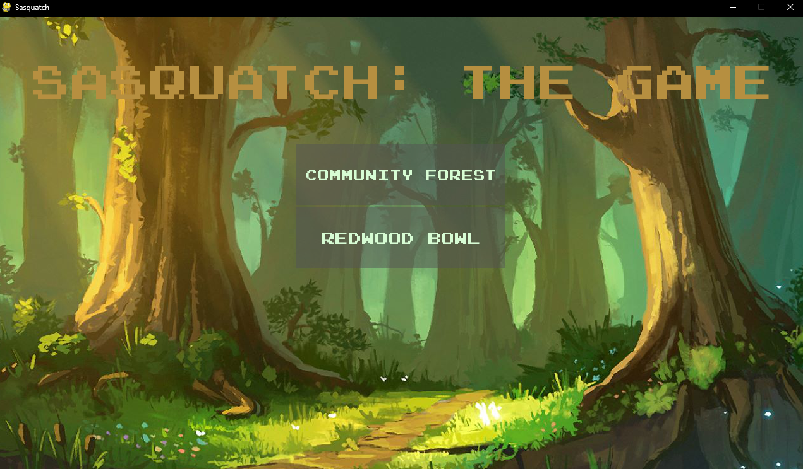

# Cal Poly Humboldt CS 458 - Software Engineering Senior Capstone Project Fall 2022 

## **Team Members:** 
- Nicolas Nellum
- Brian Buchmiller
- Kai Yukiharo
- Jacob Arsenault
## **Installation**
To play Sasquatch Game you need Python 3.10, which you can download from https://www.python.org/downloads/release/python-3100/. Follow the instructions given on Python’s website to guide the installation process.

Additionally, you will need the Pygame Library, which can be installed here: https://www.pygame.org/download.shtml. Follow the instructions given on the Pygame website to guide you through the installation process.

You can download all the necessary game code from this page. To do so, first:
1. Click on the green “<> Code” button with the drop-down arrow.
2. Click the “download ZIP” button, which will download the file in zip format to your computer. 
3. The file “CS458-Project-master.zip” should appear in your downloads pop-up. Click the “Show in folder” button, which will have the icon of a folder, to take you directly to where it downloaded to your computer. Note: if you don’t see the mentioned pop-up, simply click the “Settings and more” button on the top-right of your browser, and navigate to “Downloads” - from there the same instructions apply. 
4. Right-click the .zip file and select the “Extract All…” option. Next, you will see a screen asking you for a destination to extract the files to. If you are satisfied with where it was automatically set to, just click “Extract”, and you will now have access to the files after the subsequent progress bar reaches 100%. If you’d rather they go into an alternate location, select the “Browse” option, and navigate your preferred location. 
5. With the game files accessible, double-click  the “CS458-Project-master” file, and if you see a folder within named the same, double-click that folder as well. Once you see a plethora of .py files, and map folders, you are in the correct location. 
6. Hold the shift key and right-click simultaneously. From there, select the “Open with code” option, a blue icon, which will open all of the necessary files in Visual Studio Code. If you do not already have that program installed click the following link: Get Started Tutorial for Python in Visual Studio Code, which will walk you through not only how to install the program, but how to install the needed python extensions. 
7. Within Visual Studio Code, navigate to the main.py file, and in the upper right corner, click the “Run Python File” option, which will be in the shape of a triangle. From there, the code will run, and you will be able to play The Sasquatch Game.

